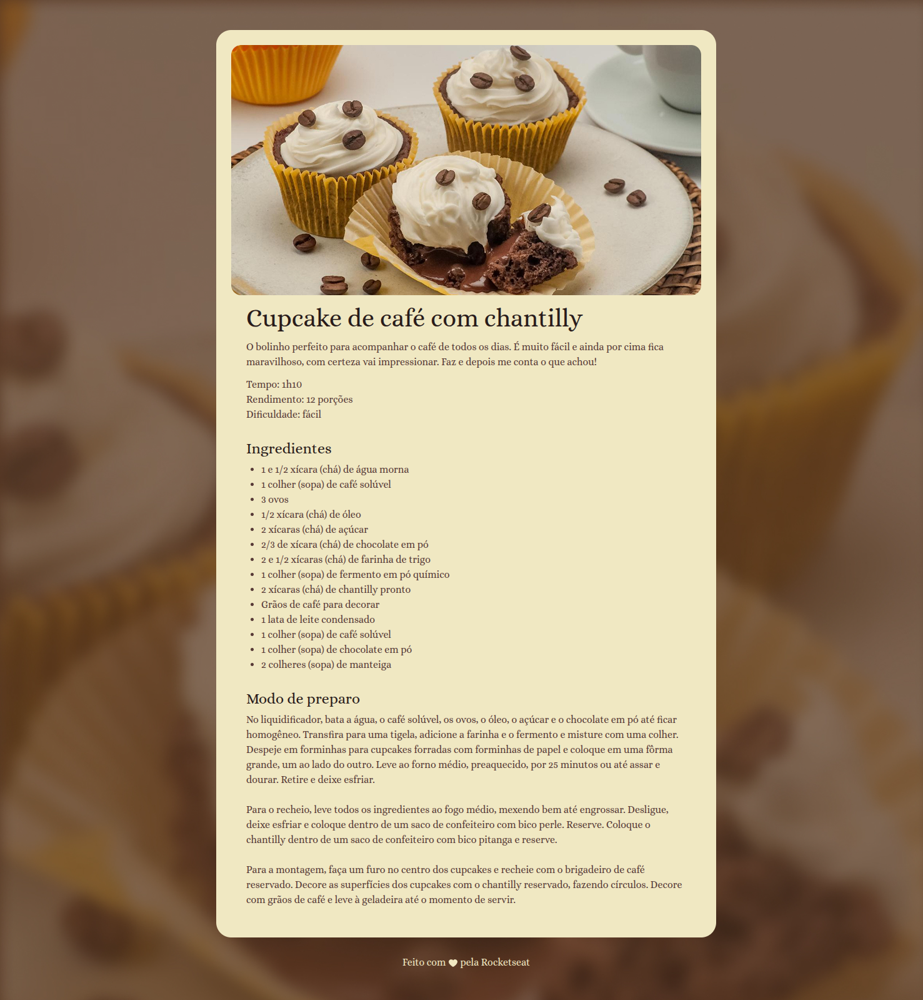

# 🧁 Receita de Cupcake de Café com Chocolate

Este repositório contém uma página simples desenvolvida com **HTML** e **CSS**, exibindo uma deliciosa receita de **cupcake de café com chocolate**. O projeto tem fins educacionais e foi criado para praticar a estruturação de conteúdo com HTML e estilização com CSS.

## 📸 Prévia

 <!-- Substitua pelo caminho correto da imagem se houver -->

## 🚀 Funcionalidades

- Estrutura semântica utilizando tags HTML5.
- Estilização com CSS puro.
- Imagens ilustrativas e seção com modo de preparo.

## 📂 Estrutura de Arquivos

## 🛠️ Tecnologias Utilizadas

- HTML5
- CSS3

### Desenvolvido com 💖, utilizando o curso Fullstack da [Rocketseat](https://www.rocketseat.com.br/) para fins de aprendizado.